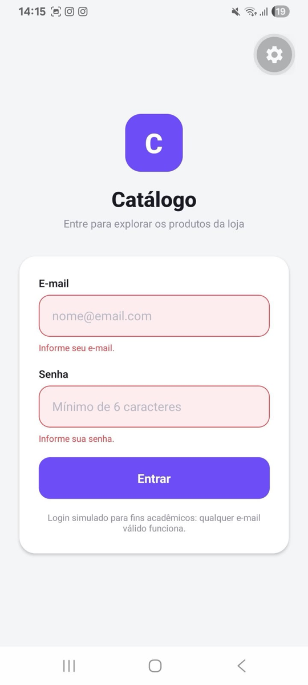
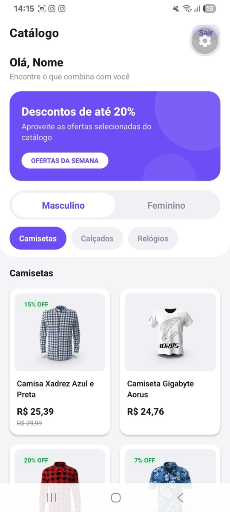
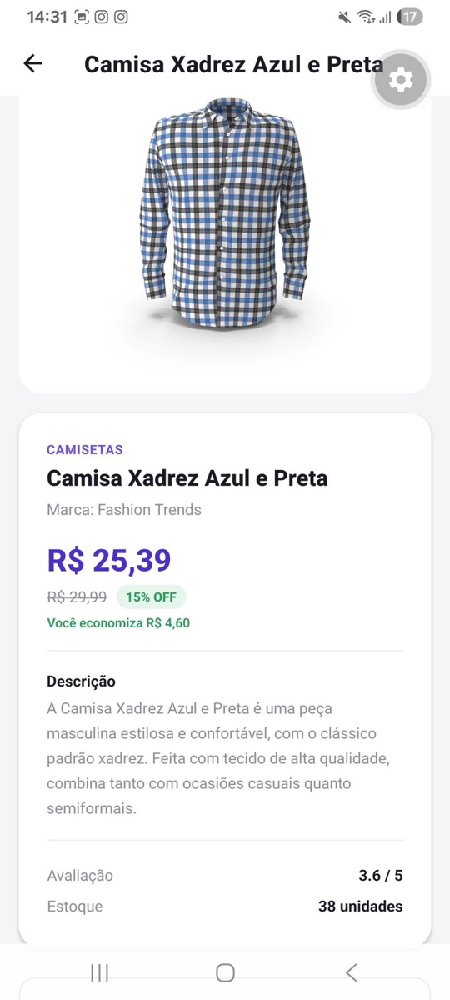

# 📱 Catálogo Interativo Mobile

Aplicativo mobile de catálogo de produtos desenvolvido em **React Native + Expo**, com listagem por categorias (masculino/feminino), consumo de API REST via **Axios**, gerenciamento de estado com **Redux Toolkit** e navegação com **React Navigation**.

---

## 📖 Descrição

### Objetivo

Desenvolver a primeira versão de um aplicativo mobile responsivo e leve para apresentar os produtos de uma loja online. O aplicativo permite que o usuário faça login, navegue por um catálogo dividido em categorias masculinas e femininas, e consulte os detalhes de qualquer produto.

### Contexto acadêmico

Projeto desenvolvido como entrega final da disciplina de **Mobile Development**. A proposta é aplicar, em um projeto real e funcional, os conceitos vistos em aula:

- consumo de APIs REST em aplicações mobile;
- navegação entre telas e fluxos de autenticação;
- gerenciamento de estado global;
- tratamento de estados de carregamento e erro;
- separação de responsabilidades e organização de projetos React Native.

### Principais funcionalidades

- Login simulado com validação de campos
- Catálogo com abas Masculino / Feminino
- 8 categorias de produtos consumidas de uma API REST real
- Tela de detalhes carregada por ID
- Logout com limpeza completa do estado
- Tratamento de carregamento, erro, retry e lista vazia

---

## ✨ Funcionalidades detalhadas

### 🔐 Login
Tela inicial do aplicativo, com campos de e-mail e senha, botão "Entrar" e feedback visual durante o processamento. O login é **simulado**: não existe backend de autenticação. Qualquer e-mail em formato válido, combinado com uma senha de 6 caracteres ou mais, autentica o usuário.

### ✅ Validação
Validação escrita em JavaScript puro, sem bibliotecas externas de formulário (sem Formik, Yup ou React Hook Form).

- **E-mail**: obrigatório e com verificação de formato básico
- **Senha**: obrigatória e com mínimo de 6 caracteres
- As mensagens aparecem **abaixo de cada campo**, com destaque visual na borda do input
- Ao tocar em "Entrar" com o formulário vazio, **as duas mensagens aparecem juntas**
- A mensagem some assim que o usuário começa a corrigir o campo

### 🛍️ Catálogo
Tela principal exibida após o login. Apresenta uma saudação personalizada com o nome derivado do e-mail informado, as abas de gênero e o seletor de categorias. A lista de produtos é renderizada com `FlatList`.

### 👔 Categorias

**Masculino**
| Categoria (app) | Slug (API) |
|---|---|
| Camisetas | `mens-shirts` |
| Calçados | `mens-shoes` |
| Relógios | `mens-watches` |

**Feminino**
| Categoria (app) | Slug (API) |
|---|---|
| Bolsas | `womens-bags` |
| Vestidos | `womens-dresses` |
| Joias | `womens-jewellery` |
| Calçados | `womens-shoes` |
| Relógios | `womens-watches` |

Ao trocar de gênero, a categoria selecionada é automaticamente reiniciada para a primeira do novo gênero.

### 🌐 API
Todos os dados vêm da API pública **DummyJSON**. Nenhum dado é local, fictício ou embutido no código. Todas as requisições são feitas com **Axios**, a partir de uma instância única com `baseURL` e `timeout` configurados.

### 🔎 Detalhes
Ao tocar em um produto, o aplicativo navega para a tela de detalhes enviando **apenas o ID** como parâmetro de rota. A tela então faz uma nova requisição a `/products/{id}` e exibe:

- imagem em alta resolução
- nome, marca e categoria (traduzida para português)
- descrição completa
- preço original, percentual de desconto e **preço final calculado**
- valor economizado
- avaliação e estoque
- botão para voltar ao catálogo

### 🧠 Redux
O **Redux Toolkit** gerencia o estado de autenticação: o usuário logado e o indicador `isAuthenticated`. É esse indicador que a navegação observa para decidir qual fluxo exibir.

### 🚪 Logout
Botão "Sair" no canto direito do cabeçalho do catálogo. Ao ser acionado, limpa todos os dados do usuário no Redux, o que faz o aplicativo retornar imediatamente à tela de login. As telas autenticadas são **desmontadas**, então não existe botão voltar ou gesto capaz de retornar ao catálogo depois do logout.

### ⏳ Loading
Todas as requisições exibem um `ActivityIndicator` com mensagem de contexto ("Carregando produtos...", "Carregando detalhes..."), tanto no catálogo quanto na tela de detalhes.

### ⚠️ Tratamento de erros
Nenhuma mensagem técnica da API chega ao usuário. Em caso de falha, o aplicativo exibe uma mensagem amigável em português acompanhada do botão **"Tentar novamente"**, que refaz a requisição. O erro original é registrado apenas no console, para depuração.

Quando a requisição funciona mas a categoria não retorna produtos, o aplicativo exibe um estado de **lista vazia** — diferente do estado de erro, para não confundir o usuário.

---

## 🛠️ Tecnologias utilizadas

| Tecnologia | Para que serve neste projeto |
|---|---|
| **React Native** | Framework para construir aplicativos nativos de Android e iOS usando JavaScript e React. Todo o aplicativo é feito com componentes nativos (`View`, `Text`, `FlatList`, `Image`, `Pressable`), sem bibliotecas de UI de terceiros. |
| **Expo** | Plataforma que elimina a configuração nativa. Permite rodar o app com um único comando (`npx expo start`) e testar em um celular físico pelo aplicativo Expo Go, sem Android Studio ou Xcode. |
| **Axios** | Cliente HTTP usado em toda a comunicação com a API. Foi escolhido em vez do `fetch()` por permitir uma instância centralizada com `baseURL` e `timeout`, e por tratar erros de status HTTP automaticamente. |
| **Redux Toolkit** | Biblioteca oficial para gerenciamento de estado global. Usada aqui exclusivamente para a autenticação, através de um `createSlice` e um `configureStore`. |
| **React Redux** | Ponte entre o React e o Redux. Fornece o `Provider`, o `useSelector` (ler estado) e o `useDispatch` (disparar ações). |
| **React Navigation** | Biblioteca de navegação. Usa a *native stack*, que entrega cabeçalho, botão de voltar e gestos nativos sem configuração adicional. |
| **DummyJSON** | API REST pública e gratuita com dados de e-commerce. Fornece produtos reais organizados por categoria, com preços, descontos e imagens. |

### Dependências instaladas

```json
"axios"
"@reduxjs/toolkit"
"react-redux"
"@react-navigation/native"
"@react-navigation/native-stack"
"react-native-screens"
"react-native-safe-area-context"
```

Nenhuma outra biblioteca foi adicionada. Bibliotecas de UI, de formulário, de persistência e de ícones foram deliberadamente evitadas, por não serem necessárias para os requisitos do projeto.

---

## 🏗️ Arquitetura

### Árvore de diretórios

```
catalogo-mobile/
│
├── App.js                          # Ponto de entrada: Provider + navegação
├── app.json                        # Configuração do Expo
├── package.json
├── babel.config.js
├── .gitignore
├── README.md
│
├── assets/                         # Ícone e splash screen
│
└── src/
    │
    ├── components/                 # Componentes reutilizáveis de interface
    │   ├── PrimaryButton.js
    │   ├── FormInput.js
    │   ├── GenderTabs.js
    │   ├── CategoryChips.js
    │   ├── ProductCard.js
    │   ├── Loading.js
    │   ├── ErrorMessage.js
    │   └── EmptyState.js
    │
    ├── constants/                  # Dados estáticos do aplicativo
    │   └── categories.js
    │
    ├── navigation/                 # Estrutura de navegação
    │   ├── AppNavigator.js
    │   ├── AuthNavigator.js
    │   └── MainNavigator.js
    │
    ├── screens/                    # Telas do aplicativo
    │   ├── LoginScreen.js
    │   ├── ProductsScreen.js
    │   └── ProductDetailsScreen.js
    │
    ├── services/                   # Comunicação com a API
    │   ├── api.js
    │   └── productsService.js
    │
    ├── store/                      # Estado global (Redux)
    │   ├── index.js
    │   └── slices/
    │       └── authSlice.js
    │
    ├── styles/                     # Tokens visuais
    │   └── theme.js
    │
    └── utils/                      # Funções auxiliares puras
        ├── price.js
        └── validation.js
```

### Para que serve cada pasta

#### `components/`
Componentes de interface reutilizáveis. São componentes **de apresentação**: recebem dados via `props` e renderizam. Nenhum deles faz requisição HTTP, acessa o Redux ou conhece a navegação. Isso os torna previsíveis e reaproveitáveis em qualquer tela.

#### `screens/`
As telas completas do aplicativo. Elas **orquestram**: buscam os dados chamando os serviços, controlam os estados de carregamento e erro, e compõem os componentes na tela. É a única camada que conhece tanto os dados quanto a interface.

#### `services/`
A camada de comunicação externa. É o **único lugar do projeto que conhece o endereço da API**. As telas pedem `getProductsByCategory('mens-shoes')` e recebem um array pronto — sem saber qual é a URL nem qual é o formato bruto da resposta.

#### `navigation/`
Toda a lógica de navegação, isolada em três arquivos. Evita que chamadas de navegação e decisões de fluxo fiquem espalhadas pelas telas.

#### `store/`
O estado global com Redux Toolkit. Contém a configuração da store e os *slices*.

#### `constants/`
Dados estáticos que não mudam em tempo de execução — no caso, as categorias e seus slugs da API. Centralizá-los evita que a mesma lista seja duplicada em arquivos diferentes.

#### `utils/`
Funções auxiliares puras: cálculo e formatação de preço, e validação de formulário. Não conhecem React nem a API, e por isso podem ser usadas em qualquer parte do projeto.

#### `styles/`
Tokens visuais (cores, espaçamentos, tipografia, raios e sombras). Nenhum arquivo escreve um código hexadecimal solto: todos importam daqui. Trocar a identidade visual do aplicativo é editar **um único arquivo**.

### Separação de responsabilidades

| Camada | Responsabilidade | Não faz |
|---|---|---|
| `components/` | Renderizar | Requisição, navegação, estado global |
| `screens/` | Orquestrar dados + interface | Conhecer URLs da API |
| `services/` | Falar com a API | Decidir o que mostrar na tela |
| `store/` | Guardar estado global | Guardar estado local de tela |
| `navigation/` | Definir fluxos e rotas | Regras de negócio |
| `utils/` | Regras puras | Depender de React |

---

## 📋 Pré-requisitos

### Obrigatórios

**Node.js** (versão LTS, 18 ou superior — recomendado 20+)
Baixe em [nodejs.org](https://nodejs.org). A instalação já inclui o **npm**.

Verifique se está tudo certo:

```bash
node --version
npm --version
```

### Para testar no celular (forma mais simples e recomendada)

**Expo Go**, aplicativo gratuito:
- Android: Google Play Store
- iOS: App Store

Não é necessário instalar Android Studio nem Xcode para rodar o projeto desta forma.

### Opcionais

**Android Studio** — apenas se você quiser usar um emulador Android em vez de um celular físico.

**Xcode** — apenas se você estiver em **macOS** e quiser usar o iOS Simulator. Não está disponível para Windows ou Linux.

---

## 🚀 Instalação

```bash
# 1. Clone o repositório
git clone URL_DO_REPOSITORIO

# 2. Entre na pasta do projeto
cd catalogo-mobile

# 3. Instale as dependências
npm install

# 4. Inicie o projeto
npx expo start
```

> Substitua `URL_DO_REPOSITORIO` pelo endereço real do repositório no GitHub.

Após o último comando, um **QR Code** aparecerá no terminal.

---

## ▶️ Como executar

### 📱 Android — celular físico (recomendado)

1. Instale o **Expo Go** pela Google Play Store.
2. Conecte o celular e o computador **na mesma rede Wi-Fi**.
3. No computador, rode `npx expo start`.
4. Abra o Expo Go e toque em **Scan QR code**.
5. Escaneie o QR Code exibido no terminal.

### 🤖 Android — emulador

1. Instale o Android Studio e crie um dispositivo virtual pelo **Device Manager**.
2. Inicie o emulador e espere ele carregar completamente.
3. Rode `npx expo start`.
4. Com o terminal em foco, pressione a tecla **`a`**.

Alternativamente: `npm run android`.

### 🍎 iPhone — celular físico

1. Instale o **Expo Go** pela App Store.
2. Conecte o iPhone e o computador na mesma rede Wi-Fi.
3. Rode `npx expo start`.
4. Abra a **câmera nativa** do iPhone e aponte para o QR Code.
5. Toque na notificação que aparece para abrir no Expo Go.

> No iOS, o QR Code é lido pela câmera do sistema, não pelo aplicativo Expo Go.

### 💻 iOS Simulator

Requer **macOS com Xcode instalado**. Não funciona em Windows ou Linux.

1. Instale o Xcode pela App Store e abra-o pelo menos uma vez.
2. Rode `npx expo start`.
3. Com o terminal em foco, pressione a tecla **`i`**.

Alternativamente: `npm run ios`.

---

## 🧪 Como testar o aplicativo

Roteiro manual completo. Siga na ordem para validar todos os requisitos.

### Login e validação

1. Inicie o aplicativo com `npx expo start` e abra-o no Expo Go.
2. Observe a tela de login: logo, título, campo de e-mail, campo de senha e botão "Entrar".
3. Toque em **Entrar** sem preencher nenhum campo.
4. Confirme que aparecem **duas mensagens de validação** ao mesmo tempo, uma abaixo de cada campo, e que as bordas dos inputs ficam vermelhas.
5. Digite um e-mail inválido, como `teste` ou `teste@`.
6. Toque em Entrar e confirme a mensagem *"Digite um e-mail válido"*.
7. Digite um e-mail válido, como `aluno@email.com`. Confirme que a mensagem de erro do campo **some sozinha** enquanto você digita.
8. Digite uma senha com menos de 6 caracteres (ex: `123`) e toque em Entrar. Confirme a mensagem sobre o mínimo de caracteres.
9. Digite uma senha válida (ex: `123456`) e toque em **Entrar**. Observe o spinner dentro do botão.
10. Confirme o redirecionamento automático para o catálogo e a saudação com seu nome no topo (ex: "Olá, Aluno").

### Catálogo masculino

11. Confirme que a aba **Masculino** já vem selecionada e que a categoria **Camisetas** está ativa.
12. Confirme que os produtos carregaram, cada um com imagem, nome, marca, preço e selo de desconto.
13. Toque em **Calçados** e depois em **Relógios**. Observe o indicador de carregamento e a troca completa da lista a cada categoria.

### Detalhes do produto

14. Selecione qualquer produto da lista.
15. Confirme que a tela de detalhes carrega (indicador de carregamento visível) e que o **título do cabeçalho muda para o nome do produto**, provando que os dados vieram da requisição por ID.
16. Confirme a presença de: imagem grande, categoria em português, nome, marca, preço final, preço original riscado, selo de desconto, valor economizado, descrição, avaliação e estoque.
17. Volte ao catálogo pelo botão do cabeçalho ou pelo botão "Voltar ao catálogo" no fim da tela.

### Catálogo feminino

18. Toque na aba **Feminino**. Confirme que a categoria selecionada volta automaticamente para a primeira (**Bolsas**) e que a lista é recarregada.
19. Teste as cinco categorias femininas: Bolsas, Vestidos, Joias, Calçados e Relógios.
20. Abra um produto feminino e confirme que os detalhes carregam corretamente.

### Tratamento de erro

21. Ative o **modo avião** no celular (ou desligue o Wi-Fi do computador).
22. Troque de categoria no catálogo.
23. Confirme que aparece a mensagem amigável *"Algo deu errado"* com o botão **"Tentar novamente"** — e **nenhuma mensagem técnica** do tipo "Network Error".
24. Desative o modo avião e toque em **Tentar novamente**. Confirme que os produtos carregam normalmente.

### Logout

25. Toque no botão **Sair**, no canto direito do cabeçalho.
26. Confirme o retorno imediato à tela de login.
27. Confirme que os campos de e-mail e senha estão **vazios**, provando que o estado foi limpo.
28. Tente voltar usando o botão físico de voltar do Android ou o gesto de arrastar no iOS. Confirme que **não é possível retornar ao catálogo** — as telas autenticadas foram desmontadas.

---

## 🔄 Fluxo da aplicação

```
                        Login
                          │
              (validação + Redux: isAuthenticated = true)
                          │
                          ▼
                       Catálogo
                          │
        ┌─────────────────┴─────────────────┐
        │                                   │
   Masculino                            Feminino
        │                                   │
   ├── Camisetas                       ├── Bolsas
   ├── Calçados                        ├── Vestidos
   └── Relógios                        ├── Joias
        │                              ├── Calçados
        │                              └── Relógios
        │                                   │
        └─────────────────┬─────────────────┘
                          │
                 (toque no produto)
                 navigate('ProductDetails', { productId })
                          │
                          ▼
                    Detalhes do produto
                    GET /products/{id}
                          │
                       Voltar
                          │
                          ▼
                       Catálogo
                          │
                       Logout
              (Redux: isAuthenticated = false)
                          │
                          ▼
                        Login
```

### Estrutura dos navegadores

```
App.js
 └── Provider (Redux store)
      └── AppNavigator          ← lê isAuthenticated
           │
           ├── [false] AuthNavigator
           │             └── Login
           │
           └── [true]  MainNavigator
                         ├── Products
                         └── ProductDetails
```

O `AppNavigator` implementa o padrão de **rotas protegidas**: quando o usuário não está autenticado, o `MainNavigator` sequer existe na árvore de navegação. Isso torna o logout seguro por construção, sem depender de nenhuma verificação manual dentro das telas.

---

## 🌐 API utilizada

**DummyJSON** — API REST pública e gratuita com dados de e-commerce.

- Site: https://dummyjson.com
- Documentação: https://dummyjson.com/docs

**Base URL configurada em `src/services/api.js`:**

```js
const api = axios.create({
  baseURL: 'https://dummyjson.com',
  timeout: 10000,
});
```

### Endpoints consumidos

#### `GET /products/category/{category}`

Retorna todos os produtos de uma categoria. A resposta vem dentro de um **envelope de paginação**:

```json
{
  "products": [ { "id": 83, "title": "...", "price": 29.99 } ],
  "total": 5,
  "skip": 0,
  "limit": 5
}
```

O serviço extrai `response.data.products` e devolve apenas o array para a tela.

#### `GET /products/{id}`

Retorna um único produto, **sem envelope** — o objeto vem direto na raiz da resposta.

### Exemplos de endpoints

```
https://dummyjson.com/products/category/mens-shirts
https://dummyjson.com/products/category/mens-shoes
https://dummyjson.com/products/category/mens-watches
https://dummyjson.com/products/category/womens-bags
https://dummyjson.com/products/category/womens-dresses
https://dummyjson.com/products/category/womens-jewellery
https://dummyjson.com/products/category/womens-shoes
https://dummyjson.com/products/category/womens-watches

https://dummyjson.com/products/1
https://dummyjson.com/products/83
```

### Propriedades utilizadas

| Campo da API | Uso no aplicativo |
|---|---|
| `id` | Chave da `FlatList` e parâmetro de navegação |
| `title` | Nome do produto |
| `description` | Descrição na tela de detalhes |
| `price` | Preço cheio |
| `discountPercentage` | Percentual de desconto e cálculo do preço final |
| `thumbnail` | Imagem do card na listagem |
| `images[0]` | Imagem em alta na tela de detalhes |
| `category` | Slug traduzido para exibição |
| `brand` | Marca |
| `rating` | Avaliação |
| `stock` | Estoque |

> ⚠️ A API **não possui** os campos `name`, `image` ou `discount`. Os nomes corretos são `title`, `thumbnail` e `discountPercentage`.

---

## 🧠 Gerenciamento de estado

### Redux Toolkit — estado global

Usado exclusivamente para a **autenticação**, em `src/store/slices/authSlice.js`.

```js
const initialState = {
  user: null,             // { name, email }
  isAuthenticated: false,
};
```

**Actions disponíveis**

| Action | Efeito |
|---|---|
| `login({ email })` | Preenche `user` e define `isAuthenticated = true` |
| `logout()` | Zera `user` e define `isAuthenticated = false` |

**Selectors**

```js
selectUser(state)             // → { name, email } | null
selectIsAuthenticated(state)  // → boolean
```

O Redux Toolkit usa a biblioteca **Immer** internamente. Por isso os reducers podem escrever `state.user = ...` diretamente: a escrita é interceptada e transformada em um novo estado imutável.

### useState — estado local

A decisão de **não** colocar tudo no Redux foi deliberada. Um estado só vai para o Redux quando precisa ser lido por partes diferentes do aplicativo.

| Estado | Onde mora | Por quê |
|---|---|---|
| Usuário logado, `isAuthenticated` | **Redux** | Lido pela navegação e pela tela de produtos |
| E-mail e senha digitados | `useState` | Existem apenas enquanto a tela de login está aberta |
| Erros de validação | `useState` | Idem |
| Lista de produtos, loading, erro | `useState` | Consumidos por uma tela apenas |
| Gênero e categoria selecionados | `useState` | Estado puramente de interface |

Colocar a lista de produtos no Redux exigiria arquivos e abstrações adicionais sem nenhum benefício real, já que nenhuma outra tela precisa desses dados.

---

## ⚠️ Tratamento de erros

### `try / catch / finally`

Toda requisição segue a mesma estrutura:

```js
try {
  const data = await getProductsByCategory(categoryId);
  setProducts(data);
} catch (requestError) {
  console.log('Falha ao buscar produtos:', requestError?.message);
  setProducts([]);
  setError(ERROR_MESSAGE);
} finally {
  setIsLoading(false);
}
```

O `finally` é essencial: garante que o indicador de carregamento desapareça **mesmo quando a requisição falha**. Sem ele, um erro deixaria o spinner girando para sempre.

### Os quatro estados de tela

| Estado | Componente | Quando aparece |
|---|---|---|
| Carregando | `Loading` | Enquanto a requisição está em andamento |
| Erro | `ErrorMessage` | Falha de rede, timeout ou erro HTTP |
| Vazio | `EmptyState` | Requisição bem-sucedida, mas sem produtos |
| Sucesso | `FlatList` | Há produtos para exibir |

### Retry

O componente `ErrorMessage` recebe uma função `onRetry` e exibe o botão **"Tentar novamente"**, que reexecuta a requisição sem precisar sair da tela.

### Timeout

A instância do Axios define `timeout: 10000`. Sem esse limite, uma conexão ruim deixaria o aplicativo aparentemente travado por tempo indeterminado. Com ele, a requisição falha em 10 segundos e cai no fluxo normal de erro.

### Condição de corrida

Ao trocar de categoria rapidamente, a resposta de uma requisição antiga pode chegar **depois** da nova e sobrescrever a lista correta. Para evitar isso, cada `useEffect` usa uma flag `isActive` marcada como falsa na função de limpeza, descartando resultados obsoletos.

### Mensagens amigáveis

Erros técnicos (`Network Error`, `Request failed with status code 404`) nunca chegam ao usuário. São registrados apenas no console. O usuário vê sempre uma mensagem em português explicando o que aconteceu e o que fazer.

---

## 💻 Comandos úteis

| Comando | O que faz |
|---|---|
| `npm install` | Instala todas as dependências listadas no `package.json`. Execute sempre após clonar o repositório. |
| `npx expo start` | Inicia o servidor de desenvolvimento e exibe o QR Code. |
| `npx expo start -c` | Inicia limpando o cache do Metro Bundler. A flag `-c` resolve a maioria dos erros estranhos após criar, mover ou renomear arquivos. |
| `npx expo start --tunnel` | Inicia usando um túnel externo. Necessário quando o celular e o computador não conseguem se enxergar na rede (Wi-Fi corporativo, firewall, redes separadas). |
| `npm run android` | Abre diretamente no emulador Android. |
| `npm run ios` | Abre diretamente no iOS Simulator (somente macOS). |
| `npx expo-doctor` | Diagnostica problemas de compatibilidade entre as dependências e o SDK do Expo. |

Com o servidor rodando, o terminal também aceita atalhos: **`a`** abre no Android, **`i`** no iOS, **`r`** recarrega o aplicativo e **`m`** abre o menu de desenvolvedor.

---

## 🔧 Troubleshooting

### O aplicativo não atualiza ou apresenta erros estranhos após alterar arquivos

Cache do Metro Bundler desatualizado. Pare o servidor e reinicie limpando o cache:

```bash
npx expo start -c
```

### `Unable to resolve module ...`

Uma dependência não foi instalada ou o caminho de um import está errado.

```bash
npm install
npx expo start -c
```

Se persistir, confira se o caminho do import corresponde à pasta real. O sistema de arquivos do Linux e do macOS diferencia maiúsculas de minúsculas: `../components/ProductCard` e `../components/productcard` não são a mesma coisa.

### O Expo Go não encontra o projeto / QR Code não conecta

Causas mais comuns, em ordem de frequência:

1. **Redes diferentes** — o celular está no 4G ou em outra rede Wi-Fi. Coloque os dois na mesma rede.
2. **Rede com isolamento de clientes** — comum em Wi-Fi de faculdades, escritórios e hotéis. Esse tipo de rede impede que dispositivos se comuniquem entre si.
3. **Firewall do computador** bloqueando a porta do Expo.

Solução que funciona em todos esses casos:

```bash
npx expo start --tunnel
```

O túnel roteia a conexão pela internet e dispensa que os aparelhos estejam na mesma rede. É um pouco mais lento, mas contorna qualquer restrição.

### Erro após atualizar dependências

Reinstale as dependências do zero:

```bash
rm -rf node_modules
rm package-lock.json
npm install
npx expo start -c
```

No Windows (PowerShell):

```powershell
Remove-Item -Recurse -Force node_modules
Remove-Item package-lock.json
npm install
npx expo start -c
```

### As imagens dos produtos não aparecem

As imagens da DummyJSON estão no formato `.webp` e são carregadas da internet. Verifique primeiro se o dispositivo tem conexão. Se as imagens continuarem sem aparecer em um aparelho específico, uma alternativa é usar o componente oficial do Expo:

```bash
npx expo install expo-image
```

E substituir o `Image` do React Native pelo `Image` do `expo-image` em `ProductCard.js` e `ProductDetailsScreen.js`.

### Aviso sobre `headerBackTitleVisible`

Essa propriedade foi renomeada em versões recentes do React Navigation. O aviso é inofensivo; se preferir removê-lo, apague a linha correspondente em `src/navigation/MainNavigator.js`. Ela afeta apenas um detalhe visual do botão voltar no iOS.

### A tela fica em branco após o login

Verifique se o `Provider` do Redux envolve o `AppNavigator` em `App.js`. Se o `Provider` estiver por dentro, o `useSelector` do `AppNavigator` não encontra a store.

---

## 📸 Screenshots

### Tela de Login
<!-- Adicione aqui o print da tela de login, incluindo o estado com as mensagens de validação -->



### Catálogo — Masculino
<!-- Adicione aqui o print do catálogo com a aba Masculino selecionada -->



### Catálogo — Feminino
<!-- Adicione aqui o print do catálogo com a aba Feminino selecionada -->


### Detalhes do Produto
<!-- Adicione aqui o print da tela de detalhes -->



> Crie uma pasta `screenshots/` na raiz do projeto e salve as imagens com os nomes acima.

---

## 📦 Como publicar no GitHub

Com o projeto pronto, na pasta raiz:

```bash
git init
git add .
git commit -m "feat: projeto inicial do catálogo mobile"
git branch -M main
git remote add origin URL_DO_REPOSITORIO
git push -u origin main
```

**O que você precisa substituir:**

- `URL_DO_REPOSITORIO` — o endereço do repositório que você criou no GitHub. Fica no formato `https://github.com/SEU_USUARIO/NOME_DO_REPOSITORIO.git`.

**Antes do primeiro push, confira:**

- O repositório foi criado como **público** no GitHub (exigência da entrega).
- O arquivo `.gitignore` existe e contém `node_modules/` e `.expo/`. Sem isso, milhares de arquivos desnecessários seriam enviados.
- O `README.md` está na raiz do projeto.

Para os commits seguintes:

```bash
git add .
git commit -m "descrição do que foi feito"
git push
```

---

## 👤 Autor

| | |
|---|---|
| **Nome** | _preencher_ |
| **Universidade** | _preencher_ |
| **Disciplina** | Mobile Development |
| **Professor(a)** | _preencher_ |
| **Semestre** | _preencher_ |

---

## 📄 Licença

Projeto desenvolvido para fins acadêmicos.
